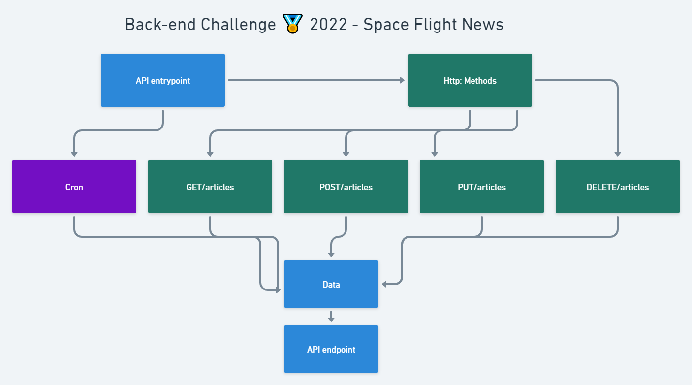

## Back-end Challenge 🏅 2022 - Space Flight News

Código criado para o desafio relacionado à vaga de Backend NodeJS na Coodesh.

Repositório do Desafio: [https://github.com/bhayron/Back-end-Challenge-2022](https://github.com/bhayron/Back-end-Challenge-2022)

Projeto realizado por Bhayron Klivilan [bhayronklivilan@gmail.com](mailto:bhayronklivilan@gmail.com)

Menu:

- [Ferramentas Utilizadas](#ferramentas-utilizadas)
- [Instalação](#instalação)
- [Arquivo de configuração](#arquivo-de-configuração)
- [Executar a aplicação com Docker](#executar-a-aplicação-com-docker)
- [Executar teste da API](#executar-teste-da-api)
- [Executar a aplicação em ambiente de desenvolvimento](#executar-a-aplicação-em-ambiente-de-desenvolvimento)
- [Acesso ao projeto](#acesso-ao-projeto)
- [Acesso a documentação (SWAGGER)](#acesso-a-documentação-swagger)



> documentação da api

## Ferramentas Utilizadas

- NestJS (framework node) utilizando Typescript
- Swagger (documentação da api)
- Docker(virtualização e integração da api)
- MongoDB(banco de dados utilizado na api)
- Jest(TDD-executor de testes unitarios)
- Lint e Prettier (formatação e qualidade do código)

## Instalação

Executar o comando para instalar as dependências:

```
 yarn
```

## Arquivo de configuração

Criar um arquivo `.env` baseado no arquivo `.env.example`, editando os valores que já existem, caso necessário.

## Executar a aplicação com Docker

Executar o comando:

```
docker-compose up
```

OBS: esse comando inicializará a aplicação

## Executar teste da API

Para testar a API , execute:

```
 yarn test
```

## Acesso ao projeto

Após executar o projeto o mesmo poderá ser visualizado através da URL:

`http://localhost:{PORT}/`

Onde `{PORT}` é o valor da porta configurada no arquivo `.env`, por padrão é a 3000.

## Acesso a documentação (SWAGGER)

Acessar:
`http://localhost:{PORT}/docs`
